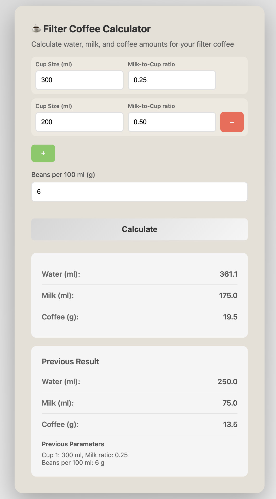

# coffee-math
Good coffee starts with good ratios. A simple filter coffee calculator.

## Overview

- Add rows to enter multiple cup sizes and milk ratios (up to 5 cups)
- Set beans per 100 ml to adjust strength (default: 6 g)
- Click Calculate to see water, milk, and coffee totals; last result is shown below

Files:
- `index.html` provides a lightweight, browser-based calculator for filter coffee ratios
- `calculate_filter_coffee.py` offers a CLI-style script for readability
